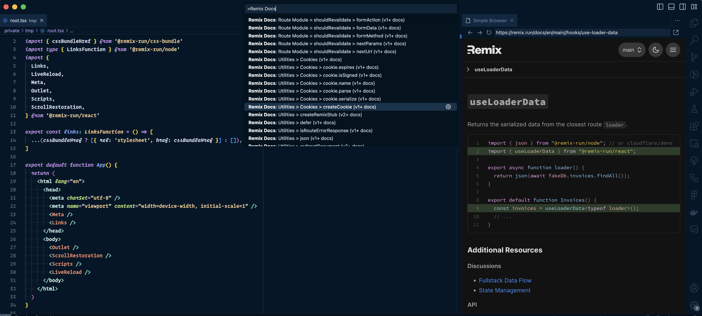
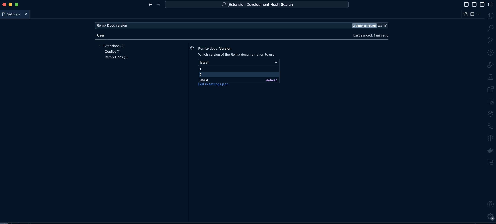

# Remix Docs

A VS Code extension for Remix.run applications that shows documentation directly inside the editor.

## Features

- Search in docs: `Cmd + Shift + P` > `"Remix Docs <search terms>"`

> Tip: VSCode supports fuzzy search, so `remd c ex` is equivalent to "**Rem**ix **D**ocs: Utilities > **C**ookies > cookie.**ex**pires".

- Optionally configure the Remix documentation version to use (default is `latest`):

## Release Notes

### 1.0.0

Initial release of Remix Docs
