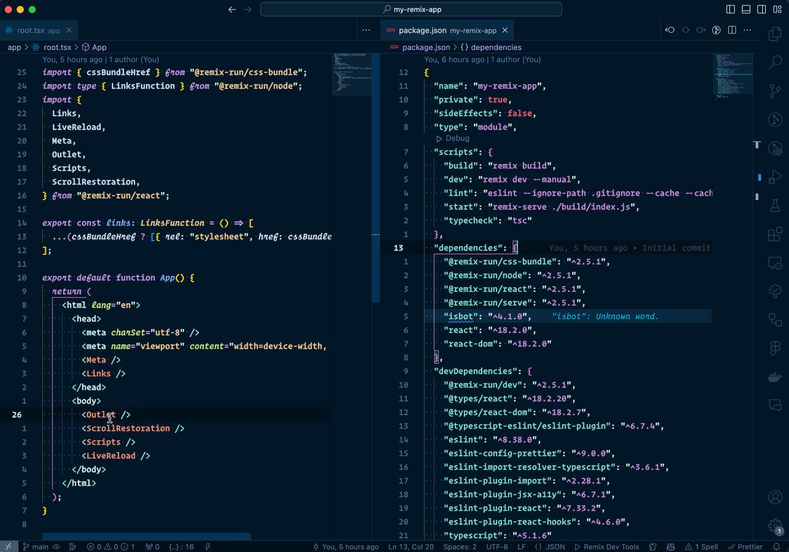
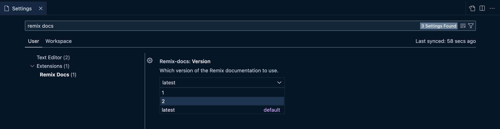

# Remix Docs

A VS Code extension for Remix.run applications that shows documentation directly inside the editor.

## Usage

Open the VS Code Command Palette (`Cmd + Shift + P` on a Mac) and enter: `"Remix Docs <search terms>"`.

> Tip: VSCode supports fuzzy search so `remd c ex` for example, is equivalent to "**Rem**ix **D**ocs: Utilities > **C**ookies > cookie.**ex**pires".

## Configuration

You can optionally configure the Remix documentation version to use for searching (default is `latest`):

## Release Notes

## 1.1.0

New:

- Components > LiveReload > origin
- Components > LiveReload > port
- Components > LiveReload > timeoutMs
- Hooks > useBlocker > state
- Hooks > useBlocker > location
- Hooks > useBlocker > preceed()
- Hooks > useBlocker > reset()
- Future > Server Bundles
- Future > SPA Mode
- Future > Vite

Fixes:

- Route Module > Hydrate Fallback
- Hooks > useFetcher > fetcher.submit
- Hooks > useSearchParams > setSearchParams
- Hooks > useSearchParams > setSearchParams(fn)

### 1.0.0

Initial release of Remix Docs
